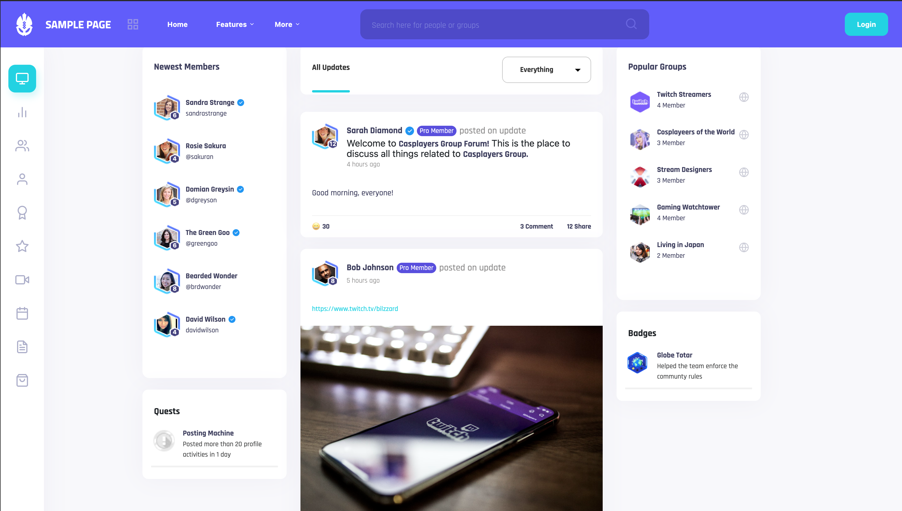

<p align="center">
 </img>
</p>

<h3 align="center">Titan</h3>

<div align="center">

[]()
[](https://github.com/wilsonshrestha/elephant-crm/issues)
[](https://github.com/wilsonshrestha/elephant-crm/pulls)
[](/LICENSE)

</div>

---

<p align="center"> 
Titan is a cutting-edge platform designed to revolutionize the way people connect and interact online. It leverages advanced algorithms and user data to foster meaningful connections among its users, with a primary focus on enhancing social experiences and strengthening online relationships.
    <br> 
</p>

## 🎥 Demo / Working <a name = "demo"></a>



### Installing

Install dependencies

```
npm install
```

Start

```
npm start
```

## 🚀 Deployment

Live demo on vercel

- [Vercel](https://titan-social.vercel.app/) - Live

## ⛏️ Built Using <a name = "built_using"></a>

- react
- react-bootstrap
- feather-icons

## 🎉 Acknowledgements <a name = "acknowledgement"></a>

- unsplash
- randomuser
